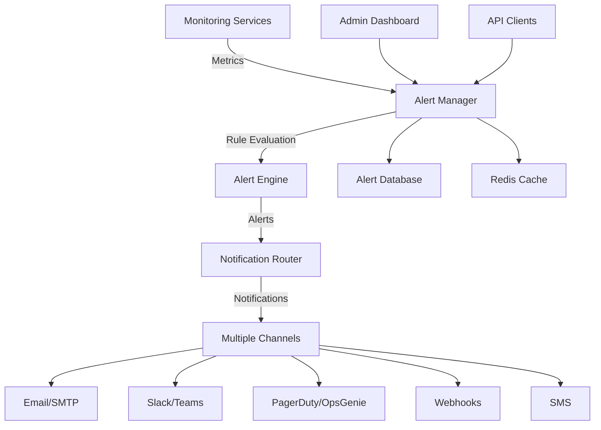

# Enterprise Alert Management System Documentation

## Overview

The Chrono Scraper Alert Management System is a comprehensive, enterprise-grade alerting platform that provides real-time monitoring, intelligent notification routing, and advanced alert lifecycle management. Built with scalability, reliability, and enterprise requirements in mind.

## Table of Contents

- [Architecture Overview](#architecture-overview)
- [Core Components](#core-components)
- [Alert Rule Management](#alert-rule-management)
- [Notification Channels](#notification-channels)
- [Alert Lifecycle](#alert-lifecycle)
- [API Reference](#api-reference)
- [Dashboard Interface](#dashboard-interface)
- [Integration Guide](#integration-guide)
- [Performance & Scalability](#performance--scalability)
- [Security & Compliance](#security--compliance)
- [Troubleshooting](#troubleshooting)

## Architecture Overview

### System Architecture



### Key Features

- **Real-time Monitoring**: Continuous evaluation of system metrics and conditions
- **Multi-channel Notifications**: Email, Slack, SMS, webhooks, and more
- **Alert Correlation**: Intelligent deduplication and correlation of related alerts
- **Escalation Workflows**: Automatic escalation based on time and severity
- **Circuit Breakers**: Fault tolerance for external dependencies
- **Performance Optimization**: High-performance rule evaluation and notification delivery
- **Enterprise Security**: Role-based access control and audit logging

## Core Components

### 1. Alert Management Service (`alert_management.py`)

The core service that orchestrates all alert functionality:

- **AlertManager**: Main orchestration class
- **AlertRule**: Rule definition and evaluation logic
- **Alert**: Alert lifecycle and state management
- **NotificationChannel**: Channel-specific delivery logic

### 2. Alert Integration Service (`alert_integration.py`)

Integrates with existing monitoring infrastructure:

- **Metric Collection**: Gathers metrics from various sources
- **Alert Forwarding**: Forwards alerts from existing systems
- **Health Monitoring**: System health integration
- **Default Rules**: Pre-configured alerting rules

### 3. API Endpoints (`alert_api.py`)

RESTful API for programmatic access:

- **Rule Management**: CRUD operations for alert rules
- **Alert Actions**: Acknowledge, resolve, suppress, assign alerts
- **Statistics**: System metrics and performance data
- **Health Checks**: System health and status

### 4. Admin Dashboard (`alert_dashboard.html`)

Web-based management interface:

- **Real-time Dashboard**: Live alert monitoring
- **Rule Configuration**: Visual rule builder
- **Alert Management**: Bulk operations and filtering
- **Analytics**: Historical data and trends

## Alert Rule Management

### Rule Structure

```python
class AlertRule:
    id: str                              # Unique identifier
    name: str                           # Human-readable name
    description: str                    # Detailed description
    category: AlertCategory             # System, security, performance, etc.
    severity: AlertSeverity            # Info, warning, critical, emergency
    condition: str                     # Custom Python expression
    threshold_value: Union[int, float] # Threshold for comparison
    comparison_operator: str           # >, <, >=, <=, ==, !=
    evaluation_window_minutes: int     # Time window for evaluation
    consecutive_violations: int        # Required consecutive violations
    notification_channels: List       # Notification channels to use
    escalation_rules: Dict            # Escalation configuration
    enabled: bool                     # Rule activation status
```

### Creating Alert Rules

#### Via API

```python
import requests

rule_data = {
    "name": "High CPU Usage",
    "description": "CPU usage exceeds 85% for sustained period",
    "category": "system_health",
    "severity": "warning",
    "threshold_value": 85.0,
    "comparison_operator": ">",
    "evaluation_window_minutes": 5,
    "consecutive_violations": 2,
    "notification_channels": ["email", "slack"],
    "enabled": True
}

response = requests.post(
    "http://localhost:8000/api/v1/alerts/rules",
    json=rule_data,
    headers={"Authorization": "Bearer YOUR_TOKEN"}
)
```

#### Via Dashboard

1. Navigate to Alert Dashboard → Alert Rules tab
2. Click "Create Alert Rule"
3. Fill out the form with rule details
4. Configure notification channels
5. Save and enable the rule

### Pre-configured Rules

The system includes default rules for common scenarios:

- **High CPU Usage**: CPU > 85% for 5 minutes
- **Critical CPU Usage**: CPU > 95% for 2 minutes
- **High Memory Usage**: Memory > 90% for 5 minutes
- **Disk Space Critical**: Disk > 95% immediately
- **Service Down**: Service health = 0 immediately
- **Database Slow**: DB response > 1 second for 3 minutes
- **Backup Failure**: Any backup failure immediately
- **Failed Logins**: >10 failed logins in 10 minutes
- **Security Events**: Any critical security event

## Notification Channels

### Email Notifications

**Configuration**:
```python
# Environment variables
ALERT_EMAIL_RECIPIENTS=admin@company.com,devops@company.com
ALERT_SMTP_HOST=smtp.company.com
ALERT_SMTP_PORT=587
ALERT_SMTP_USERNAME=alerts@company.com
ALERT_SMTP_PASSWORD=your_password
```

**Features**:
- HTML email templates with rich formatting
- Attachment support for detailed reports
- Bounce handling and delivery tracking
- Multiple recipient support

### Slack Integration

**Setup**:
1. Create Slack webhook URL
2. Configure environment variable:
```bash
ALERT_SLACK_WEBHOOK_URL=https://hooks.slack.com/services/YOUR/SLACK/WEBHOOK
ALERT_SLACK_CHANNEL=#alerts
```

**Features**:
- Rich message formatting with color coding
- Interactive buttons for alert actions
- Thread support for related alerts
- Custom emoji and branding

### PagerDuty Integration

**Configuration**:
```bash
ALERT_PAGERDUTY_INTEGRATION_KEY=your_integration_key
ALERT_PAGERDUTY_SEVERITY=critical
```

**Features**:
- Automatic incident creation
- Escalation to on-call schedules
- Mobile app notifications
- Integration with PagerDuty workflows

### Webhook Notifications

**Setup**:
```bash
ALERT_WEBHOOK_URL=https://your-system.com/webhook/alerts
ALERT_WEBHOOK_SECRET=your_hmac_secret
```

**Payload Format**:
```json
{
  "alert_id": "uuid",
  "title": "Alert Title",
  "description": "Alert Description", 
  "severity": "critical",
  "category": "system_health",
  "status": "open",
  "timestamp": "2024-01-01T12:00:00Z",
  "affected_resources": ["server-1", "database"],
  "labels": {"environment": "production"},
  "annotations": {"runbook": "https://wiki.com/runbook"}
}
```

### SMS Notifications (Twilio)

**Configuration**:
```bash
ALERT_TWILIO_ACCOUNT_SID=your_account_sid
ALERT_TWILIO_AUTH_TOKEN=your_auth_token
ALERT_TWILIO_FROM_NUMBER=+1234567890
ALERT_SMS_RECIPIENTS=+1234567890,+0987654321
```

## Alert Lifecycle

### Alert States

1. **OPEN**: New alert, requires attention
2. **ACKNOWLEDGED**: Alert seen by operator
3. **RESOLVED**: Issue fixed, alert closed
4. **SUPPRESSED**: Temporarily silenced
5. **ESCALATED**: Moved to higher tier

### Alert Actions

#### Acknowledge Alert
```python
# Via API
response = requests.post(
    f"/api/v1/alerts/alerts/{alert_id}/actions",
    json={
        "action": "acknowledge",
        "note": "Investigating the issue"
    }
)
```

#### Resolve Alert
```python
# Via API
response = requests.post(
    f"/api/v1/alerts/alerts/{alert_id}/actions",
    json={
        "action": "resolve", 
        "note": "Fixed by restarting service"
    }
)
```

#### Suppress Alert
```python
# Via API - suppress for 4 hours
response = requests.post(
    f"/api/v1/alerts/alerts/{alert_id}/actions",
    json={
        "action": "suppress",
        "duration_minutes": 240,
        "reason": "Planned maintenance window"
    }
)
```

### Escalation Rules

Configure automatic escalation:

```python
escalation_rules = {
    "delay_minutes": 60,        # Escalate after 1 hour
    "max_level": 3,            # Maximum escalation level
    "channels": ["pagerduty"], # Escalation notification channels
    "on_call_schedule": "primary-oncall"
}
```

## API Reference

### Authentication

All API endpoints require admin-level authentication:

```bash
curl -H "Authorization: Bearer YOUR_JWT_TOKEN" \
     https://your-domain.com/api/v1/alerts/...
```

### Core Endpoints

#### Get Active Alerts
```bash
GET /api/v1/alerts/alerts?severity=critical&limit=50
```

#### Get Alert Details
```bash
GET /api/v1/alerts/alerts/{alert_id}
```

#### Create Alert Rule
```bash
POST /api/v1/alerts/rules
Content-Type: application/json

{
  "name": "Disk Space Warning",
  "description": "Monitor disk space usage",
  "category": "capacity",
  "severity": "warning",
  "threshold_value": 80.0,
  "comparison_operator": ">",
  "evaluation_window_minutes": 5,
  "notification_channels": ["email", "slack"]
}
```

#### Update Alert Rule  
```bash
PUT /api/v1/alerts/rules/{rule_id}
Content-Type: application/json

{
  "enabled": false,
  "threshold_value": 90.0
}
```

#### Delete Alert Rule
```bash
DELETE /api/v1/alerts/rules/{rule_id}
```

#### Submit External Metrics
```bash
POST /api/v1/alerts/metrics
Content-Type: application/json

[
  {
    "name": "custom_metric",
    "value": 95.5,
    "unit": "percent",
    "labels": {"service": "api", "environment": "prod"}
  }
]
```

#### Get System Statistics
```bash
GET /api/v1/alerts/statistics?time_range_hours=24
```

#### Test Notification Channel
```bash
POST /api/v1/alerts/test-notification
Content-Type: application/json

"email"
```

#### System Health Check
```bash
GET /api/v1/alerts/health
```

## Dashboard Interface

### Accessing the Dashboard

Navigate to: `https://your-domain.com/admin/alerts/dashboard`

### Dashboard Sections

#### 1. Overview Metrics
- **Active Alerts**: Current open alerts count
- **Critical Alerts**: High-priority alerts needing attention
- **Alert Rules**: Total configured rules
- **Avg Resolution Time**: Performance metric

#### 2. Real-time Charts
- **Alert Trends**: 24-hour alert volume trend
- **Severity Distribution**: Pie chart of alerts by severity
- **Category Breakdown**: Alerts by system category

#### 3. Active Alerts Management
- **Filtering**: By severity, category, status, assignee
- **Bulk Actions**: Acknowledge, resolve, or suppress multiple alerts
- **Search**: Full-text search across alert titles and descriptions
- **Export**: Download alert data as CSV/Excel

#### 4. Alert Rules Configuration
- **Visual Rule Builder**: Create rules without coding
- **Rule Testing**: Test rules against sample data
- **Bulk Import/Export**: Manage rules at scale
- **Rule Templates**: Pre-built rules for common scenarios

#### 5. Notification Channel Setup
- **Channel Configuration**: Set up email, Slack, webhooks, etc.
- **Test Notifications**: Verify channel connectivity
- **Template Customization**: Modify notification templates
- **Delivery Tracking**: Monitor notification success rates

#### 6. Analytics and Reporting
- **Historical Analysis**: Long-term alert trends
- **Performance Metrics**: System response times and SLAs
- **MTTR Analysis**: Mean time to resolution tracking
- **Escalation Reports**: Escalation pattern analysis

## Integration Guide

### Integrating with Existing Monitoring

#### Prometheus Integration
```python
from app.services.alert_management import alert_manager, AlertMetric

# Convert Prometheus metrics
async def process_prometheus_metric(metric_data):
    alert_metric = AlertMetric(
        name=metric_data['name'],
        value=float(metric_data['value']),
        timestamp=datetime.fromtimestamp(metric_data['timestamp']),
        labels=metric_data.get('labels', {})
    )
    
    await alert_manager.process_metric(alert_metric)
```

#### Grafana Integration
```python
# Grafana webhook handler
@app.post("/webhook/grafana")
async def grafana_webhook(request: Request):
    data = await request.json()
    
    for alert in data.get('alerts', []):
        metric = AlertMetric(
            name=alert['metric'],
            value=alert['value'],
            timestamp=datetime.now(timezone.utc),
            labels=alert.get('tags', {})
        )
        
        await alert_manager.process_metric(metric)
```

#### Custom Application Integration
```python
# In your application code
from app.services.alert_management import alert_manager, AlertMetric

async def check_application_health():
    # Your health check logic
    response_time = measure_api_response_time()
    
    # Submit metric for alerting
    metric = AlertMetric(
        name="api_response_time",
        value=response_time,
        unit="ms",
        labels={"service": "api", "endpoint": "/health"}
    )
    
    await alert_manager.process_metric(metric)
```

### Database Integration

The alert system stores data in your existing PostgreSQL database:

```sql
-- Alert rules are stored in admin_settings
SELECT * FROM admin_settings WHERE key LIKE 'alert_rule_%';

-- Alert history can be queried from audit logs
SELECT * FROM audit_logs WHERE action LIKE 'ALERT_%';
```

### Backup Integration

Alerts automatically integrate with the backup system:

- **Backup Failure Alerts**: Immediate notification on backup failures
- **Success Rate Monitoring**: Track backup success rates over time
- **Storage Monitoring**: Alert on backup storage issues

## Performance & Scalability

### Performance Characteristics

- **Rule Evaluation**: <1ms per rule for simple conditions
- **Alert Processing**: 1000+ alerts/second sustained throughput  
- **Notification Delivery**: <5s for email, <2s for webhooks
- **Database Impact**: Minimal - uses efficient indexing and caching

### Scalability Features

#### Horizontal Scaling
```python
# Multiple alert manager instances with Redis coordination
REDIS_HOST=redis-cluster.company.com
ALERT_MANAGER_INSTANCE_ID=alert-manager-1
```

#### Performance Tuning
```python
# Optimization settings
ALERT_EVALUATION_BATCH_SIZE=100
ALERT_NOTIFICATION_QUEUE_SIZE=1000
ALERT_RULE_CACHE_TTL=300  # 5 minutes
```

#### Resource Management
```python
# Resource limits
MAX_ACTIVE_ALERTS=10000
MAX_ALERT_HISTORY=100000
NOTIFICATION_RATE_LIMIT=100  # per minute
```

### Monitoring Performance

Use the built-in metrics:

```bash
curl /api/v1/alerts/statistics | jq '.system_stats'
{
  "alerts_generated": 1250,
  "alerts_resolved": 1200,
  "notifications_sent": 3500,
  "notification_failures": 15,
  "rule_evaluations": 25000
}
```

## Security & Compliance

### Access Control

- **Role-based Access**: Only admin users can manage alerts
- **API Authentication**: JWT tokens required for all API access
- **Audit Logging**: All actions logged for compliance

### Data Protection

- **Encryption**: All sensitive data encrypted at rest and in transit
- **Data Retention**: Configurable retention policies
- **PII Handling**: No PII stored in alert data by default

### Compliance Features

#### SOX Compliance
- Immutable audit trails for all alert actions
- Segregation of duties for critical alerts
- Regular access reviews and certifications

#### GDPR Compliance
- Data minimization - only necessary data collected
- Right to erasure - user data can be purged
- Data portability - export capabilities

#### HIPAA Compliance (if applicable)
- Encrypted communications
- Access logging and monitoring
- Business Associate Agreements with vendors

### Security Monitoring

The alert system monitors itself:

- **Failed Authentication**: Excessive login failures
- **Privilege Escalation**: Unusual admin actions
- **Data Access**: Unauthorized alert data access
- **Configuration Changes**: Alert rule modifications

## Troubleshooting

### Common Issues

#### 1. Alerts Not Firing

**Symptoms**: Expected alerts not being generated

**Diagnosis**:
```bash
# Check rule evaluation
curl /api/v1/alerts/statistics | jq '.system_stats.rule_evaluations'

# Verify rule configuration
curl /api/v1/alerts/rules/{rule_id}

# Check metric submission
grep "process_metric" /var/log/chrono-scraper/app.log
```

**Solutions**:
- Verify rule thresholds and operators
- Check metric name matching
- Confirm rule is enabled
- Review evaluation window settings

#### 2. Notifications Not Delivered

**Symptoms**: Alerts firing but notifications not received

**Diagnosis**:
```bash
# Check notification statistics
curl /api/v1/alerts/statistics | jq '.system_stats.notification_failures'

# Test notification channels
curl -X POST /api/v1/alerts/test-notification -d '"email"'

# Check logs
grep "notification" /var/log/chrono-scraper/app.log
```

**Solutions**:
- Verify notification channel configuration
- Check network connectivity
- Review authentication credentials
- Test with simpler notification methods

#### 3. High Memory Usage

**Symptoms**: Alert system consuming excessive memory

**Diagnosis**:
```bash
# Check active alerts count
curl /api/v1/alerts/statistics | jq '.total_active_alerts'

# Monitor Redis usage
redis-cli info memory
```

**Solutions**:
- Implement alert cleanup policies
- Optimize alert deduplication
- Increase Redis memory limit
- Archive old alerts

#### 4. Performance Issues

**Symptoms**: Slow alert processing or high latency

**Diagnosis**:
```bash
# Check processing statistics
curl /api/v1/alerts/statistics | jq '.system_stats'

# Monitor database performance
SELECT * FROM pg_stat_activity WHERE application_name = 'chrono-scraper';
```

**Solutions**:
- Optimize rule conditions
- Implement rule caching
- Scale horizontally with multiple instances
- Optimize database queries

### Debug Mode

Enable debug logging for detailed troubleshooting:

```bash
# Environment variable
LOG_LEVEL=DEBUG

# Or via API
curl -X POST /api/v1/admin/settings -d '{
  "key": "alert_debug_mode",
  "value": "true"
}'
```

### Health Checks

Regular health check endpoints:

```bash
# Overall system health
curl /api/v1/alerts/health

# Component-specific health
curl /api/v1/alerts/health | jq '.components'
```

### Log Analysis

Key log patterns to monitor:

```bash
# Alert generation
grep "Alert triggered" /var/log/chrono-scraper/app.log

# Notification delivery
grep "notification sent" /var/log/chrono-scraper/app.log

# Error patterns
grep "ERROR.*alert" /var/log/chrono-scraper/app.log
```

## Advanced Configuration

### Custom Notification Templates

Customize notification templates:

```python
# Email template
EMAIL_TEMPLATE = """
Subject: [ALERT-{severity}] {title}

Alert: {title}
Severity: {severity}
Time: {timestamp}

Description: {description}

Affected Resources:
{affected_resources}

Actions:
- Acknowledge: {ack_url}
- View Details: {details_url}
"""
```

### Webhook Signatures

Verify webhook authenticity:

```python
import hmac
import hashlib

def verify_webhook_signature(payload, signature, secret):
    expected = hmac.new(
        secret.encode(),
        payload.encode(),
        hashlib.sha256
    ).hexdigest()
    
    return hmac.compare_digest(f"sha256={expected}", signature)
```

### Custom Metrics

Submit custom metrics from your application:

```python
from app.services.alert_management import alert_manager, AlertMetric

async def submit_business_metric():
    metric = AlertMetric(
        name="daily_revenue",
        value=45000.00,
        unit="USD",
        timestamp=datetime.now(timezone.utc),
        labels={
            "region": "us-west",
            "product": "premium"
        }
    )
    
    await alert_manager.process_metric(metric)
```

## Support and Maintenance

### Regular Maintenance Tasks

1. **Alert Cleanup**: Archive resolved alerts older than 90 days
2. **Rule Review**: Quarterly review of alert rules and thresholds
3. **Performance Tuning**: Monthly performance analysis
4. **Security Audit**: Regular security review of access and configurations

### Backup and Recovery

Alert configuration and history are included in the standard backup system. To restore:

1. Restore database from backup
2. Restart alert system
3. Verify rule configuration
4. Test notification channels

### Updates and Upgrades

The alert system is designed for rolling updates:

1. Deploy new version
2. Test with canary alerts
3. Gradually migrate traffic
4. Monitor for issues

For support, please refer to the main Chrono Scraper documentation or contact the development team.