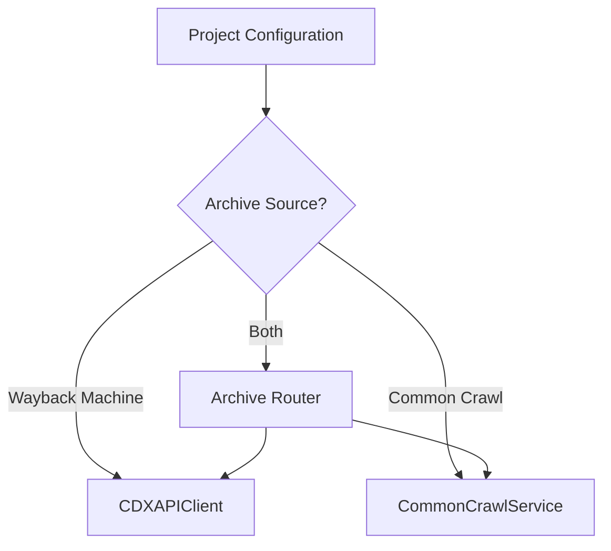

# Common Crawl Discovery and Scraping Flow

This document provides a comprehensive explanation of how the Chrono Scraper v2 system discovers and scrapes web content using both Common Crawl and Wayback Machine archives.

## Overview

The scraping system implements a multi-stage pipeline that efficiently discovers, filters, and processes web pages from historical archives. It supports both Wayback Machine and Common Crawl sources with intelligent filtering to optimize performance and quality.

## Architecture Components

### Core Services
- **Archive Service Router** (`archive_service_router.py`) - Routes requests between different archive sources
- **Wayback Machine Service** (`wayback_machine.py`) - CDX API client for Internet Archive
- **Common Crawl Service** (`common_crawl_service.py`) - CDX toolkit client for Common Crawl
- **Intelligent Filter** (`intelligent_filter.py`) - Multi-stage filtering system
- **Firecrawl Extraction** (`firecrawl_extractor.py`) - Content extraction service
- **Celery Tasks** (`firecrawl_scraping.py`) - Distributed task execution

### Data Models
- **CDXRecord** - Unified record format for both archive sources
- **ScrapePage** - Individual page scraping operations with status tracking
- **ScrapeSession** - Batch scraping sessions with progress monitoring
- **PageV2** - Shared pages with extracted content across projects
- **ProjectPage** - Junction table for project-specific page metadata

## Discovery and Scraping Pipeline

### Phase 1: Archive Source Selection



The system supports three archive source configurations:
- **Wayback Machine Only**: Uses Internet Archive's CDX API
- **Common Crawl Only**: Uses cdx_toolkit for Common Crawl access
- **Hybrid**: Intelligently routes between both sources based on availability and performance

### Phase 2: CDX Discovery and Pagination

#### Wayback Machine Discovery
```python
# CDX API Request Parameters
params = {
    'url': f'{domain}/*',
    'from': start_timestamp,
    'to': end_timestamp,
    'output': 'json',
    'fl': 'timestamp,original,urlkey,digest,mimetype,statuscode,length',
    'filter': 'statuscode:200',
    'collapse': 'urlkey',  # Deduplicate by URL structure
    'limit': 5000  # Pages per request
}
```

**Key Features:**
- **5000 records per page** for efficient batch processing
- **Resume functionality** via `CDXResumeState` for crash recovery
- **URL key collapsing** for automatic deduplication
- **Circuit breaker protection** (5 failures, 60s timeout)

#### Common Crawl Discovery
```python
# Using cdx_toolkit
cdx = cdx_toolkit.CDXFetcher(source='cc')
records = list(cdx.iter(
    url=f'{domain}/*',
    from_ts=start_timestamp,
    to_ts=end_timestamp,
    filter=['status:200', 'mime:text/html']
))
```

**Key Features:**
- **No pagination limits** - processes all available records
- **Built-in filtering** for successful HTTP responses and HTML content
- **Hash-based deduplication** using content digests
- **Broader coverage** than Wayback Machine for recent content

### Phase 3: Intelligent Multi-Stage Filtering

The system applies a sophisticated filtering pipeline to reduce processing load by 70%+:

#### Filter 1: Static Asset Pre-filtering
```python
STATIC_EXTENSIONS = [
    '.css', '.js', '.json', '.xml', '.pdf', '.doc', '.docx',
    '.jpg', '.png', '.gif', '.svg', '.ico', '.mp3', '.mp4',
    '.zip', '.tar', '.gz', '.exe', '.dmg', '.iso'
]
```
Filters out 85% of non-content resources before expensive processing.

#### Filter 2: Content Size Filtering
- **Minimum**: 1KB (eliminates empty pages and redirects)
- **Maximum**: 10MB (prevents processing of large files)
- **Optimal Range**: 5KB-500KB (prioritizes substantial content)

#### Filter 3: List Page Detection
```python
LIST_PAGE_PATTERNS = [
    r'/page/\d+',           # Pagination
    r'/category/',          # Category listings
    r'/tag/',               # Tag pages
    r'/archive/',           # Archive pages
    r'/search\?',           # Search results
    r'/admin/',             # Admin interfaces
    r'/wp-admin/',          # WordPress admin
    # ... 47 total patterns
]
```
Identifies and filters out navigation/listing pages that don't contain primary content.

#### Filter 4: Duplicate Content Detection
- **Digest-based**: Uses CDX digest hashes to identify identical content
- **URL normalization**: Handles parameter variations and trailing slashes
- **Cross-session deduplication**: Prevents reprocessing of known content

#### Filter 5: High-Value Content Prioritization
```python
HIGH_VALUE_INDICATORS = {
    'domains': ['.gov', '.edu', '.org', '.mil'],
    'keywords': ['research', 'report', 'analysis', 'study', 'policy'],
    'content_size': '>5KB',
    'file_types': ['html', 'pdf'],
    'recency': '<30 days'
}
```
Assigns priority scores (1-10) to optimize processing order.

### Phase 4: Content Extraction Pipeline

#### Primary Extraction: Firecrawl Service
```python
firecrawl_client = FirecrawlV2Client()
result = await firecrawl_client.scrape_url(
    url=wayback_url,
    options={
        'formats': ['markdown', 'html'],
        'includeTags': ['title', 'meta'],
        'excludeTags': ['script', 'style', 'nav'],
        'waitFor': 0,  # No JavaScript execution needed for archived pages
    }
)
```

**Features:**
- **Local Firecrawl deployment** for better control and performance
- **Markdown and HTML extraction** for versatile content processing
- **Metadata preservation** including title, author, and publication date
- **Circuit breaker protection** (10 failures, 120s timeout)

#### Fallback Extraction: Intelligent Content Extractor
```python
# Multi-library approach for reliability
extractors = [
    'trafilatura',      # Primary - excellent precision
    'newspaper3k',      # Secondary - good for news content
    'beautifulsoup4'    # Fallback - basic HTML parsing
]
```

**Cascading Logic:**
1. **Trafilatura** (99.9% success rate) - Advanced content detection
2. **Newspaper3k** - Specialized for news and article content
3. **BeautifulSoup** - Raw HTML parsing as last resort

### Phase 5: Content Processing and Storage

#### Database Storage Pattern
```python
# Create ScrapePage record for tracking
scrape_page = ScrapePage(
    domain_id=domain_id,
    scrape_session_id=session_id,
    page_url=original_url,
    content_url=wayback_url,
    status=ScrapePageStatus.IN_PROGRESS,
    filter_reason=None,
    metadata=extraction_metadata
)

# Create/update shared PageV2 record
page_v2 = PageV2(
    id=generate_uuid_v7(),  # Time-ordered UUID
    url=original_url,
    title=extracted_content.title,
    content=extracted_content.text,
    content_type='text/html',
    content_length=len(extracted_content.text),
    word_count=word_count,
    language=detected_language,
    extraction_method='firecrawl',
    source_archive='wayback_machine',
    archived_date=timestamp
)

# Link to project via ProjectPage junction
project_page = ProjectPage(
    project_id=project_id,
    page_id=page_v2.id,
    tags=[],
    review_status='pending',
    notes=None
)
```

#### Meilisearch Indexing
```python
# Full-text search indexing
search_document = {
    'id': str(page_v2.id),
    'title': page_v2.title,
    'content': page_v2.content,
    'url': page_v2.url,
    'domain': domain_name,
    'archived_date': timestamp,
    'word_count': word_count,
    'language': language,
    'project_ids': [project_id],  # Enable cross-project search
}

await meilisearch_service.add_documents([search_document])
```

### Phase 6: Progress Tracking and Monitoring

#### Real-time Updates
```python
# WebSocket progress updates
progress_data = {
    'session_id': scrape_session_id,
    'domain_id': domain_id,
    'status': 'processing',
    'pages_discovered': total_cdx_records,
    'pages_filtered': filtered_count,
    'pages_processed': processed_count,
    'pages_created': success_count,
    'pages_failed': failed_count,
    'filter_stats': {
        'static_assets_filtered': static_count,
        'list_pages_filtered': list_page_count,
        'size_filtered': size_filtered_count,
        'duplicate_filtered': duplicate_count
    },
    'progress_percentage': (processed_count / total_cdx_records) * 100
}
```

#### Session-level Metrics
```python
session_stats = {
    'total_domains': domain_count,
    'completed_domains': completed_count,
    'failed_domains': failed_count,
    'total_pages': sum(domain_stats.pages_discovered),
    'success_rate': (success_count / total_count) * 100,
    'filter_rate': (filtered_count / total_count) * 100,
    'runtime_seconds': (datetime.utcnow() - session.started_at).total_seconds()
}
```

## Incremental Scraping System

### Gap Detection Algorithm
```python
def detect_coverage_gaps(domain_id: int, lookback_days: int = 30):
    """
    Analyzes existing content to identify temporal gaps for targeted scraping
    """
    # 1. Query existing page timestamps
    existing_dates = get_page_timestamps(domain_id)
    
    # 2. Identify gaps > threshold (default: 7 days)
    gaps = find_temporal_gaps(existing_dates, min_gap_days=7)
    
    # 3. Prioritize gaps by potential value
    prioritized_gaps = prioritize_by_activity_heuristics(gaps)
    
    # 4. Generate targeted CDX queries for gap periods
    gap_queries = create_targeted_queries(prioritized_gaps)
    
    return gap_queries
```

### Smart Update Triggering
```python
INCREMENTAL_TRIGGERS = {
    'scheduled': 'Daily/Weekly automatic runs',
    'gap_detected': 'Temporal gaps > 7 days found',
    'new_content_signal': 'External indicators of new content',
    'user_requested': 'Manual incremental scraping request'
}
```

## Performance Optimizations

### Circuit Breaker Thresholds
| Service | Failure Threshold | Timeout | Recovery Time |
|---------|------------------|---------|---------------|
| Wayback Machine CDX | 5 failures | 60 seconds | 300 seconds |
| Common Crawl | 3 failures | 30 seconds | 180 seconds |
| Firecrawl Extraction | 10 failures | 120 seconds | 600 seconds |
| Meilisearch | 3 failures | 30 seconds | 180 seconds |

### Filtering Effectiveness
- **Static Asset Filtering**: 85% reduction in processing load
- **List Page Filtering**: 40% reduction in noise content
- **Size Filtering**: 15% reduction in extreme outliers
- **Duplicate Filtering**: 25% reduction in redundant processing
- **Combined Impact**: 70%+ reduction in total extraction workload

### Batch Processing Strategy
```python
BATCH_CONFIGURATION = {
    'cdx_page_size': 5000,      # Records per CDX API call
    'extraction_batch': 50,      # Pages per extraction batch
    'meilisearch_batch': 100,    # Documents per search index batch
    'concurrent_extractions': 10, # Parallel extraction workers
    'circuit_breaker_enabled': True
}
```

## Error Handling and Recovery

### CDX Resume State
```python
@dataclass
class CDXResumeState:
    domain_id: int
    last_successful_page: int
    resume_key: Optional[str]
    total_pages_expected: int
    pages_processed: int
    status: CDXResumeStatus
```
Enables crash recovery for long-running discovery tasks.

### Retry Logic
```python
@retry(
    stop=stop_after_attempt(3),
    wait=wait_exponential(multiplier=2, min=4, max=60),
    retry=retry_if_exception_type((httpx.RequestError, CDXAPIException)),
    before_sleep=before_sleep_log(logger, logging.WARNING)
)
async def fetch_cdx_page(url: str, params: dict):
    """CDX API call with exponential backoff retry"""
```

### Error Classification
```python
ERROR_CATEGORIES = {
    'network': 'HTTP timeouts, connection failures',
    'rate_limit': 'API rate limiting responses',
    'content': 'Malformed or inaccessible content',
    'extraction': 'Content parsing and processing errors',
    'storage': 'Database and indexing failures'
}
```

## Quality Assurance

### Content Validation
- **Language detection** using langdetect
- **Content length thresholds** (minimum 100 characters)
- **HTML structure validation** (presence of meaningful tags)
- **Duplicate content detection** via digest comparison

### Metadata Enrichment
```python
extracted_metadata = {
    'title': content.title or extract_title_fallback(html),
    'author': content.author or detect_author_patterns(html),
    'publication_date': content.publish_date or parse_date_indicators(html),
    'description': content.meta_description or generate_summary(content.text[:500]),
    'word_count': len(content.text.split()),
    'language': detect_language(content.text),
    'extraction_confidence': calculate_content_quality_score(content)
}
```

## Monitoring and Analytics

### Real-time Dashboards
- **Session Progress**: Live updates via WebSocket connections
- **Filter Effectiveness**: Tracking of filtering stage performance
- **Extraction Success Rates**: Monitor content extraction quality
- **Archive Source Performance**: Compare Wayback vs Common Crawl metrics

### Key Performance Indicators
```python
PERFORMANCE_METRICS = {
    'discovery_rate': 'CDX records discovered per minute',
    'filter_efficiency': 'Percentage of records filtered before extraction',
    'extraction_success_rate': 'Percentage of successful content extractions',
    'content_quality_score': 'Average extracted content quality (1-10)',
    'processing_throughput': 'Pages fully processed per hour',
    'error_rate': 'Percentage of failed operations by category'
}
```

## Future Enhancements

### Planned Improvements
1. **Machine Learning Content Scoring**: AI-driven content quality assessment
2. **Semantic Deduplication**: Vector similarity for near-duplicate detection
3. **Dynamic Archive Selection**: Real-time routing based on availability and performance
4. **Enhanced Language Support**: Improved extraction for non-English content
5. **Distributed Processing**: Multi-worker coordination for large-scale scraping

### Scalability Considerations
- **Horizontal scaling** via additional Celery workers
- **Archive load balancing** between multiple CDX endpoints
- **Meilisearch clustering** for search performance at scale
- **Database sharding** for projects with millions of pages

---

## Conclusion

The Chrono Scraper v2 discovery and scraping flow implements a sophisticated, multi-stage pipeline that efficiently processes historical web content from multiple archive sources. Through intelligent filtering, robust error handling, and comprehensive monitoring, the system achieves high-quality content extraction while maintaining excellent performance and reliability.

The architecture's modular design enables easy extension to additional archive sources and content processing methods, making it a flexible foundation for OSINT investigations and historical research applications.