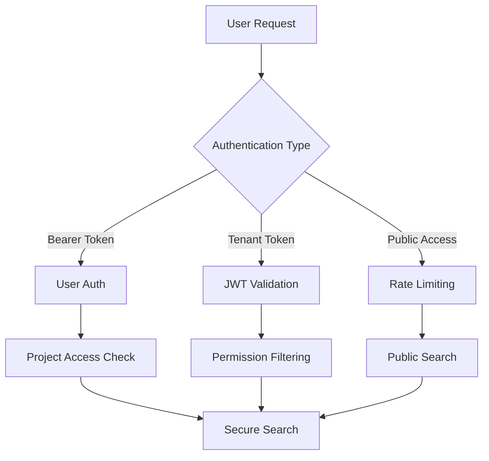

# Meilisearch Multi-Tenancy API Documentation

## Overview

The Meilisearch Multi-Tenancy system provides secure, isolated search capabilities with a 4-tier key architecture ensuring complete project separation. This document covers all API endpoints, security models, and usage patterns.

## Security Architecture

### 4-Tier Key System

1. **Master Keys** (Admin only) - Full Meilisearch administrative access
2. **Project Owner Keys** - Full access to specific project index
3. **JWT Tenant Tokens** - Time-limited shared access with permissions
4. **Public Keys** - Read-only public access with rate limiting

### Authentication Flow



## Core Search Endpoints

### Project Search (Authenticated)

**Endpoint:** `GET /api/v1/meilisearch/projects/{project_id}/search`

**Description:** Secure search within a project using project-specific API keys.

**Parameters:**
- `project_id` (path) - Project identifier
- `q` (query) - Search query string
- `limit` (query) - Results limit (1-100, default: 20)
- `offset` (query) - Pagination offset
- `filters` (query) - Meilisearch filter expression
- `facets` (query) - Comma-separated facet fields

**Headers:**
- `Authorization: Bearer <jwt_token>` - User authentication token

**Response:**
```json
{
  "hits": [...],
  "totalHits": 1234,
  "facetDistribution": {...},
  "processingTimeMs": 45,
  "query": "search term",
  "limit": 20,
  "offset": 0,
  "projectId": 123,
  "accessType": "owner"
}
```

**Security Features:**
- Automatic project ownership verification
- Project-specific API key usage
- Permission-based filtering for shared access

### Public Search

**Endpoint:** `GET /api/v1/meilisearch/public/projects/{project_id}/search`

**Description:** Public search with read-only access and rate limiting.

**Parameters:**
- `project_id` (path) - Project identifier
- `q` (query) - Search query string
- `limit` (query) - Results limit (1-50, default: 20)
- `offset` (query) - Pagination offset

**Headers:**
- No authentication required

**Response:**
```json
{
  "hits": [...],
  "totalHits": 1234,
  "processingTimeMs": 45,
  "query": "search term",
  "limit": 20,
  "offset": 0,
  "projectId": 123,
  "projectTitle": "Public Research Database",
  "allowDownloads": false,
  "isPublicSearch": true,
  "rateLimitInfo": {
    "limit": 100,
    "remaining": 95,
    "resetTime": 1672531200
  }
}
```

**Rate Limiting:**
- 100 requests per hour per IP
- Automatic blocking for abuse patterns
- 429 status code when limits exceeded

### Tenant Token Search

**Endpoint:** `GET /api/v1/meilisearch/projects/{project_id}/search/tenant`

**Description:** Search using JWT tenant tokens for shared access.

**Parameters:**
- `project_id` (path) - Project identifier
- `tenant_token` (query) - JWT tenant token
- `q` (query) - Search query string
- `limit` (query) - Results limit (1-100, default: 20)
- `offset` (query) - Pagination offset

**Headers:**
- No additional authentication required (token in query)

**Response:**
```json
{
  "hits": [...],
  "totalHits": 1234,
  "processingTimeMs": 45,
  "query": "search term",
  "limit": 20,
  "offset": 0,
  "projectId": 123,
  "accessType": "tenant_token"
}
```

**Permission Filtering:**
- `READ` - Full access to all content
- `LIMITED` - Hides irrelevant pages (`review_status != 'irrelevant'`)
- `RESTRICTED` - Only relevant content (`review_status = 'relevant'`)

## Sharing & Access Management

### Get Share Token

**Endpoint:** `GET /api/v1/sharing/projects/{project_id}/share-token`

**Description:** Generate JWT tenant token for shared project access.

**Headers:**
- `Authorization: Bearer <jwt_token>` - User authentication token

**Response:**
```json
{
  "token": "eyJhbGciOiJIUzI1NiIsInR5cCI6IkpXVCJ9...",
  "expires_at": "2024-12-31T23:59:59Z",
  "permissions": "limited",
  "index_name": "project_123",
  "project_name": "Research Project",
  "access_level": "Limited access - irrelevant content hidden"
}
```

### Get Owner Search Key

**Endpoint:** `GET /api/v1/sharing/projects/{project_id}/owner-search-key`

**Description:** Get project owner's dedicated search key.

**Headers:**
- `Authorization: Bearer <jwt_token>` - Project owner authentication

**Response:**
```json
{
  "key": "abc123...",
  "index_name": "project_123",
  "permissions": ["search", "documents.get"],
  "created_at": "2024-01-15T10:30:00Z",
  "last_rotated": null,
  "key_status": {
    "status": "active",
    "expires_at": null
  }
}
```

### Configure Public Search

**Endpoint:** `POST /api/v1/sharing/projects/{project_id}/public-search`

**Description:** Configure public search access for a project.

**Request Body:**
```json
{
  "is_enabled": true,
  "custom_title": "Public Research Database",
  "custom_description": "Open access to research findings",
  "rate_limit_per_hour": 100,
  "allow_downloads": false
}
```

**Response:**
```json
{
  "id": 456,
  "project_id": 123,
  "is_enabled": true,
  "custom_title": "Public Research Database",
  "search_key": "xyz789...",
  "search_key_uid": "key-uid-123",
  "key_created_at": "2024-01-15T10:30:00Z",
  "rate_limit_per_hour": 100,
  "allow_downloads": false
}
```

### Get Public Search Key

**Endpoint:** `GET /api/v1/sharing/public/projects/{project_id}/search-key`

**Description:** Get public search key for anonymous access.

**Rate Limited:** Yes (50 requests per hour per IP)

**Response:**
```json
{
  "key": "public-key-123...",
  "index_name": "project_123",
  "permissions": ["search"],
  "rate_limit_per_hour": 100,
  "project_title": "Public Research Database",
  "allow_downloads": false
}
```

## Key Management

### Rotate Project Key

**Endpoint:** `POST /api/v1/sharing/projects/{project_id}/rotate-key`

**Description:** Manually rotate a project's search key.

**Headers:**
- `Authorization: Bearer <jwt_token>` - Project owner authentication

**Response:**
```json
{
  "message": "Key rotated successfully",
  "new_key": "new-key-123...",
  "rotated_at": "2024-01-15T10:30:00Z",
  "index_name": "project_123"
}
```

### Get Key Status

**Endpoint:** `GET /api/v1/sharing/projects/{project_id}/key-status`

**Description:** Get detailed status for all project keys.

**Response:**
```json
{
  "project_id": 123,
  "owner_key": {
    "key_uid": "key-uid-123",
    "created_at": "2024-01-15T10:30:00Z",
    "last_rotated": null,
    "rotation_enabled": true
  },
  "all_keys": [...],
  "key_count": 3
}
```

## Monitoring & Analytics

### Key Health Overview

**Endpoint:** `GET /api/v1/monitoring/key-health/overview`

**Description:** System-wide key health monitoring (Admin only).

**Response:**
```json
{
  "timestamp": "2024-01-15T10:30:00Z",
  "system_health": {
    "meilisearch_status": "healthy",
    "meilisearch_health": {...}
  },
  "key_statistics": {
    "total_keys": 1250,
    "active_keys": 1200,
    "keys_needing_rotation": 15,
    "rotation_health_score": 85
  },
  "project_coverage": {
    "total_projects": 500,
    "projects_with_keys": 495,
    "coverage_percentage": 99.0
  },
  "health_score": 92
}
```

### Project Key Health

**Endpoint:** `GET /api/v1/monitoring/key-health/projects/{project_id}`

**Description:** Detailed key health for specific project.

**Response:**
```json
{
  "project_id": 123,
  "project_name": "Research Project",
  "key_health": [...],
  "security_events": [...],
  "sharing_info": {...},
  "health_score": 95,
  "recommendations": [
    "Project key security is optimal"
  ]
}
```

### Usage Analytics

**Endpoint:** `GET /api/v1/monitoring/analytics/usage/overview`

**Description:** Comprehensive usage analytics (Admin only).

**Parameters:**
- `days_back` (query) - Analysis period (1-365, default: 30)

**Response:**
```json
{
  "period_days": 30,
  "overview": {
    "total_requests": 125000,
    "average_requests_per_key": 104.2,
    "active_keys": 1200,
    "utilization_rate": 96.0
  },
  "usage_by_type": [...],
  "top_performing_keys": [...],
  "usage_trends": {...}
}
```

### Rate Limit Analytics

**Endpoint:** `GET /api/v1/monitoring/analytics/rate-limits`

**Description:** Rate limiting effectiveness analytics (Admin only).

**Parameters:**
- `days_back` (query) - Analysis period (1-30, default: 7)

**Response:**
```json
{
  "period_days": 7,
  "rate_limit_statistics": {...},
  "blocked_identifiers": [...],
  "effectiveness_metrics": {
    "total_requests_monitored": 50000,
    "total_identifiers_blocked": 125,
    "block_rate_percentage": 0.25,
    "effectiveness_score": 85
  }
}
```

### Usage Forecast

**Endpoint:** `GET /api/v1/monitoring/analytics/forecast`

**Description:** Predictive usage analytics.

**Parameters:**
- `project_id` (query) - Optional project filter
- `forecast_days` (query) - Forecast period (7-90, default: 30)

**Response:**
```json
{
  "forecast_days": 30,
  "historical_analysis": {
    "average_daily_usage": 4167.5,
    "growth_rate": 0.15
  },
  "forecast": [...],
  "summary": {
    "total_projected_requests": 140000,
    "confidence_level": 0.82
  }
}
```

## Rate Limiting

### Current Limits

| Endpoint Type | Requests/Hour | Burst Limit | Block Duration |
|---------------|---------------|-------------|----------------|
| Public Search | 100 | 10 | 5 minutes |
| Public Key Access | 50 | 5 | 10 minutes |
| Tenant Token | 200 | 20 | 5 minutes |

### Rate Limit Headers

All rate-limited endpoints include these headers:

```http
X-RateLimit-Limit: 100
X-RateLimit-Remaining: 95
X-RateLimit-Reset: 1672531200
Retry-After: 300
```

### Rate Limit Exceeded Response

**Status Code:** `429 Too Many Requests`

**Response:**
```json
{
  "error": "Rate limit exceeded",
  "limit": 100,
  "remaining": 0,
  "reset_time": 1672531200,
  "retry_after": 300
}
```

## Error Handling

### Common Error Codes

| Code | Description | Example |
|------|-------------|---------|
| 400 | Bad Request | Invalid parameters |
| 401 | Unauthorized | Missing/invalid auth token |
| 403 | Forbidden | Insufficient permissions |
| 404 | Not Found | Project/key not found |
| 429 | Rate Limited | Too many requests |
| 500 | Server Error | System error |

### Error Response Format

```json
{
  "detail": "Error description",
  "status_code": 403,
  "timestamp": "2024-01-15T10:30:00Z",
  "request_id": "req-123-456"
}
```

## Security Best Practices

### Key Management
1. **Rotate keys regularly** (90-day default cycle)
2. **Monitor key usage** for anomalies
3. **Revoke unused keys** to minimize attack surface
4. **Use least-privilege** principle for sharing

### Rate Limiting
1. **Monitor blocked IPs** for abuse patterns
2. **Adjust limits** based on legitimate usage
3. **Implement IP whitelisting** for trusted sources
4. **Use CDN/proxy** for additional protection

### Access Control
1. **Validate project ownership** before key access
2. **Implement permission filtering** for shared access
3. **Log security events** for audit trails
4. **Use JWT expiration** for time-limited access

## Integration Examples

### Frontend Integration

```javascript
// Project owner search
const searchProject = async (projectId, query) => {
  const response = await fetch(
    `/api/v1/meilisearch/projects/${projectId}/search?q=${query}`,
    {
      headers: {
        'Authorization': `Bearer ${userToken}`
      }
    }
  );
  return response.json();
};

// Public search with rate limit handling
const publicSearch = async (projectId, query) => {
  try {
    const response = await fetch(
      `/api/v1/meilisearch/public/projects/${projectId}/search?q=${query}`
    );
    
    if (response.status === 429) {
      const retryAfter = response.headers.get('Retry-After');
      throw new Error(`Rate limited. Retry after ${retryAfter} seconds`);
    }
    
    return response.json();
  } catch (error) {
    console.error('Search failed:', error);
    throw error;
  }
};
```

### Tenant Token Usage

```javascript
// Get tenant token for sharing
const getShareToken = async (projectId) => {
  const response = await fetch(
    `/api/v1/sharing/projects/${projectId}/share-token`,
    {
      headers: {
        'Authorization': `Bearer ${userToken}`
      }
    }
  );
  return response.json();
};

// Use tenant token for search
const searchWithTenantToken = async (projectId, tenantToken, query) => {
  const response = await fetch(
    `/api/v1/meilisearch/projects/${projectId}/search/tenant?tenant_token=${tenantToken}&q=${query}`
  );
  return response.json();
};
```

## Troubleshooting

### Common Issues

1. **403 Forbidden on search**
   - Verify project ownership
   - Check token validity
   - Ensure project has search enabled

2. **429 Rate Limited**
   - Implement exponential backoff
   - Check rate limit headers
   - Consider using authenticated endpoints

3. **Empty search results**
   - Verify index exists
   - Check permission filters
   - Ensure content is indexed

4. **Tenant token expired**
   - Generate new token
   - Check expiration settings
   - Implement token refresh logic

### Support Endpoints

- **Health Check:** `GET /api/v1/meilisearch/health`
- **Rate Limit Health:** `GET /api/v1/monitoring/rate-limits/health`
- **Analytics Health:** `GET /api/v1/monitoring/analytics/health`

For additional support, monitor the system health endpoints and check the security event logs through the admin dashboard.