# Phase 3: Advanced Analytics UI & Interactive Dashboard System

## Executive Summary

Phase 3 transforms the Chrono Scraper platform into an enterprise-grade analytics powerhouse with advanced interactive dashboards, machine learning insights, and self-service analytics capabilities. Building on the robust Phase 2 DuckDB foundation, Phase 3 delivers a world-class user experience that rivals commercial business intelligence platforms.

## Strategic Objectives

### 🎯 Primary Goals
- **Transform User Experience**: Interactive dashboards with drag-and-drop analytics builder
- **Enable Self-Service Analytics**: No-code query builder for non-technical users  
- **Advanced Visualizations**: D3.js-powered interactive charts and real-time updates
- **Machine Learning Integration**: Predictive analytics and intelligent recommendations
- **Enterprise Features**: Advanced sharing, collaboration, and governance tools

### 📊 Success Metrics
- **User Engagement**: 300% increase in analytics feature usage
- **Query Self-Service**: 80% reduction in custom analytics requests
- **Time-to-Insight**: 90% reduction in analysis workflow time
- **User Satisfaction**: >4.5/5 dashboard usability rating
- **Feature Adoption**: >70% adoption of advanced analytics features

## Phase 3 Architecture Overview

```mermaid
graph TB
    subgraph "Frontend Analytics Platform"
        A[Interactive Dashboard Builder] --> B[Real-Time Visualization Engine]
        A --> C[No-Code Query Builder]
        A --> D[Collaborative Analytics]
        
        B --> E[D3.js Visualization Library]
        B --> F[WebGL Performance Rendering]
        B --> G[Real-Time Data Streaming]
        
        C --> H[Visual Query Interface]
        C --> I[Intelligent Auto-Complete]
        C --> J[Query Template Library]
        
        D --> K[Dashboard Sharing]
        D --> L[Annotation System]
        D --> M[Version Control]
    end
    
    subgraph "ML & Intelligence Layer"
        N[Predictive Analytics Engine] --> O[Trend Forecasting]
        N --> P[Anomaly Detection]  
        N --> Q[Content Quality Scoring]
        
        R[Recommendation Engine] --> S[Query Suggestions]
        R --> T[Dashboard Recommendations]
        R --> U[Data Discovery]
    end
    
    subgraph "Phase 2 Analytics Foundation"
        V[DuckDB Analytics API] --> W[HybridQueryRouter]
        V --> X[Multi-Level Caching]
        V --> Y[Real-Time Monitoring]
    end
    
    A --> V
    N --> V
    R --> V
```



## Core Component Implementation Plan

### 1. Interactive Dashboard Builder (Weeks 1-4)

**🎨 Drag-and-Drop Dashboard Designer**
```typescript
interface DashboardBuilder {
    // Visual dashboard composition
    createDashboard(config: DashboardConfig): Promise<Dashboard>
    addWidget(dashboardId: string, widget: WidgetConfig): Promise<void>
    updateLayout(dashboardId: string, layout: GridLayout): Promise<void>
    
    // Real-time preview and validation
    previewWidget(widget: WidgetConfig): Promise<WidgetPreview>
    validateQuery(query: QueryBuilder): Promise<QueryValidation>
    
    // Template and component management
    saveAsTemplate(dashboard: Dashboard): Promise<DashboardTemplate>
    getWidgetLibrary(): Promise<WidgetLibrary>
}
```

**Key Features:**
- **Grid-Based Layout**: Responsive grid system with drag-and-drop positioning
- **Widget Library**: 20+ pre-built chart types and analytics components  
- **Real-Time Preview**: Live data preview during dashboard construction
- **Template System**: Save and share dashboard templates across organization
- **Responsive Design**: Mobile-first responsive dashboard layouts

**Technical Implementation:**
- **SvelteKit 5**: Advanced reactive framework with runes
- **@dnd-kit**: Drag-and-drop with accessibility support
- **CSS Grid**: Native responsive grid layouts
- **WebSocket Integration**: Real-time collaboration during dashboard building

### 2. Advanced Visualization Engine (Weeks 5-8)

**📊 High-Performance Visualization Platform**
```typescript
interface VisualizationEngine {
    // Chart rendering and optimization
    createVisualization(data: Dataset, config: ChartConfig): Promise<Chart>
    updateVisualization(chartId: string, data: Dataset): Promise<void>
    
    // Interactive features
    addInteractivity(chart: Chart, interactions: InteractionConfig[]): Promise<void>
    enableDrillDown(chart: Chart, drillConfig: DrillDownConfig): Promise<void>
    
    // Performance optimization
    enableVirtualization(chart: Chart, threshold: number): Promise<void>
    optimizeForLargeDatasets(chart: Chart): Promise<void>
}
```

**Advanced Chart Types:**
- **Time Series**: Advanced time-series charts with zoom, pan, and brush selection
- **Geospatial**: Interactive maps with domain/location analytics
- **Network Graphs**: Content relationship and link analysis visualizations  
- **Heatmaps**: Content quality and performance correlation analysis
- **Sankey Diagrams**: Data flow and pipeline visualization
- **Custom D3**: Extensible custom visualization framework

**Performance Features:**
- **WebGL Rendering**: Hardware-accelerated rendering for 100k+ data points
- **Data Virtualization**: Efficient handling of massive datasets
- **Progressive Loading**: Streaming data updates with smooth animations
- **Memory Management**: Intelligent garbage collection and resource cleanup

### 3. No-Code Query Builder (Weeks 9-12)

**🔧 Visual Query Construction Interface**
```typescript
interface NoCodeQueryBuilder {
    // Visual query building
    createQuery(builder: QueryBuilderConfig): Promise<Query>
    addFilter(queryId: string, filter: FilterConfig): Promise<void>
    addAggregation(queryId: string, agg: AggregationConfig): Promise<void>
    
    // Intelligent assistance
    suggestColumns(context: QueryContext): Promise<ColumnSuggestion[]>
    suggestFilters(columns: Column[]): Promise<FilterSuggestion[]>
    
    // Query optimization
    optimizeQuery(query: Query): Promise<OptimizedQuery>
    explainQuery(query: Query): Promise<QueryExplanation>
}
```

**User Experience Features:**
- **Visual Query Builder**: Drag-and-drop interface for query construction
- **Natural Language Input**: "Show me domains with high error rates last week"
- **Smart Auto-Complete**: Context-aware suggestions based on data schema
- **Query Templates**: Pre-built queries for common analytics scenarios
- **Visual Query Explanation**: Understand what your query does with visual flow

**AI-Powered Features:**
- **Intent Recognition**: Understand user analytics intent and suggest queries
- **Data Discovery**: Automatic detection of interesting data patterns
- **Query Optimization**: Automatic query rewriting for better performance
- **Result Interpretation**: AI-powered insights about query results

### 4. Real-Time Analytics Dashboard (Weeks 13-16)

**⚡ Live Analytics and Monitoring Platform**
```typescript
interface RealTimeDashboard {
    // Live data streaming
    subscribeToMetrics(metrics: MetricConfig[]): Promise<Subscription>
    updateDashboard(dashboardId: string, data: RealTimeData): Promise<void>
    
    // Alert and notification system
    createAlert(config: AlertConfig): Promise<Alert>
    manageNotifications(userId: string): Promise<NotificationPreferences>
    
    // Performance monitoring
    monitorSystemHealth(): Promise<HealthMetrics>
    trackUserActivity(): Promise<ActivityMetrics>
}
```

**Live Dashboard Features:**
- **Real-Time Updates**: Sub-second data updates via WebSocket streaming
- **System Health Monitoring**: Live system performance and resource metrics
- **User Activity Tracking**: Real-time user engagement and session analytics  
- **Alert Management**: Configurable alerts with multiple notification channels
- **Performance Analytics**: Live query performance and optimization metrics

**Advanced Capabilities:**
- **Multi-Screen Support**: Dashboard wall displays for operations centers
- **Mobile Dashboards**: Responsive mobile-first dashboard experience
- **Offline Capability**: Progressive web app with offline data caching
- **Export Integration**: Real-time dashboard export to multiple formats

### 5. Machine Learning Analytics Engine (Weeks 17-20)

**🤖 AI-Powered Analytics and Insights**
```typescript
interface MLAnalyticsEngine {
    // Predictive analytics
    forecastTrends(data: TimeSeriesData, config: ForecastConfig): Promise<Forecast>
    detectAnomalies(data: Dataset, config: AnomalyConfig): Promise<Anomaly[]>
    
    // Content intelligence
    scoreContentQuality(content: ContentData): Promise<QualityScore>
    classifyContent(content: ContentData): Promise<ContentClassification>
    
    // User behavior analysis
    analyzeUserPatterns(userData: UserActivity[]): Promise<UserInsights>
    recommendActions(context: AnalyticsContext): Promise<Recommendation[]>
}
```

**Machine Learning Features:**
- **Trend Forecasting**: Predict domain growth, content volume, and user engagement
- **Anomaly Detection**: Identify unusual patterns in scraping performance or content quality  
- **Content Classification**: Automatic categorization and quality scoring
- **User Behavior Analytics**: Understanding user interaction patterns and preferences
- **Predictive Maintenance**: Forecast system resource needs and potential issues

**AI-Powered Insights:**
- **Automated Report Generation**: AI-written summaries of key findings
- **Smart Data Discovery**: Automatic identification of interesting data relationships
- **Optimization Recommendations**: AI suggestions for query and system optimization
- **Trend Analysis**: Intelligent detection of emerging patterns and trends

### 6. Collaborative Analytics Platform (Weeks 21-24)

**👥 Team Collaboration and Knowledge Sharing**
```typescript
interface CollaborativePlatform {
    // Dashboard sharing and collaboration
    sharedashboard(dashboardId: string, permissions: SharingConfig): Promise<void>
    collaborateOnDashboard(dashboardId: string, session: CollabSession): Promise<void>
    
    // Annotation and discussion system
    addAnnotation(dashboardId: string, annotation: Annotation): Promise<void>
    createDiscussion(topic: AnalyticsTopic): Promise<Discussion>
    
    // Version control and governance
    createDashboardVersion(dashboardId: string): Promise<Version>
    manageDashboardGovernance(policies: GovernancePolicy[]): Promise<void>
}
```

**Collaboration Features:**
- **Dashboard Sharing**: Granular permissions for viewing, editing, and managing
- **Real-Time Collaboration**: Multiple users editing dashboards simultaneously
- **Annotation System**: Add contextual notes and insights to visualizations
- **Discussion Threads**: Team discussions around specific analytics findings
- **Version Control**: Track dashboard changes with rollback capabilities

**Enterprise Governance:**
- **Access Control**: Role-based permissions and data access policies  
- **Audit Logging**: Complete audit trail of dashboard access and modifications
- **Data Governance**: Ensure compliance with data privacy and security policies
- **Usage Analytics**: Track dashboard usage and adoption across teams

## Advanced Features and Capabilities

### 🔍 Advanced Analytics Features

**Custom Analytics Workflows:**
- **Multi-Step Analysis**: Chain multiple queries and visualizations
- **Data Pipeline Builder**: Visual ETL pipeline construction
- **Custom Metrics**: Define and track custom business metrics
- **Advanced Filtering**: Complex multi-dimensional filtering with AND/OR logic
- **Data Blending**: Combine data from multiple sources and time periods

**Statistical Analysis:**
- **Statistical Testing**: Built-in statistical significance testing
- **Correlation Analysis**: Automatic correlation detection between metrics
- **Cohort Analysis**: User and content cohort tracking over time
- **A/B Testing**: Built-in A/B testing framework for feature optimization
- **Regression Analysis**: Advanced statistical modeling capabilities

### 📱 Mobile-First Experience

**Progressive Web Application:**
- **Offline Capability**: Cached dashboards and data for offline viewing
- **Native Mobile Features**: Push notifications, device integration
- **Touch Optimized**: Touch-friendly interactions and gestures  
- **Mobile Dashboards**: Mobile-specific dashboard layouts and widgets
- **Cross-Device Sync**: Seamless experience across desktop, tablet, and mobile

### 🎯 Performance and Scalability

**Frontend Performance:**
- **Virtual Scrolling**: Efficient handling of large data lists
- **Lazy Loading**: Progressive loading of dashboard components
- **Code Splitting**: Optimized JavaScript bundles with dynamic imports
- **Service Worker**: Advanced caching and offline capabilities
- **WebGL Acceleration**: Hardware-accelerated rendering for complex visualizations

**Scalability Features:**
- **CDN Integration**: Global content delivery for fast loading times
- **Micro-Frontend Architecture**: Scalable component-based architecture
- **Horizontal Scaling**: Support for distributed dashboard rendering
- **Caching Strategy**: Multi-level caching from browser to CDN

## Implementation Timeline and Milestones

### 🗓️ Phase 3 Development Schedule (24 Weeks)

**Weeks 1-4: Dashboard Builder Foundation**
- Interactive dashboard grid system
- Basic widget library (10 chart types)
- Drag-and-drop functionality
- Template system implementation

**Weeks 5-8: Advanced Visualizations**
- D3.js integration and chart library  
- WebGL performance rendering
- Interactive features (zoom, pan, drill-down)
- Custom visualization framework

**Weeks 9-12: No-Code Query Builder**
- Visual query construction interface
- Natural language query processing
- Smart auto-complete and suggestions  
- Query template library

**Weeks 13-16: Real-Time Dashboard**
- WebSocket streaming integration
- Live data updates and notifications
- System health monitoring dashboard
- Mobile responsive design

**Weeks 17-20: Machine Learning Integration**
- Predictive analytics engine
- Anomaly detection system
- Content intelligence features
- User behavior analysis

**Weeks 21-24: Collaboration Platform**
- Dashboard sharing and permissions
- Real-time collaboration features
- Annotation and discussion system
- Enterprise governance tools

### 🎯 Success Criteria and KPIs

**User Experience Metrics:**
- **Dashboard Creation Time**: <10 minutes for complex dashboards
- **Query Builder Adoption**: >70% of users creating custom queries
- **Mobile Usage**: >40% of dashboard views on mobile devices
- **Collaboration Engagement**: >50% of dashboards shared across teams

**Performance Benchmarks:**
- **Dashboard Load Time**: <2 seconds for complex dashboards  
- **Real-Time Update Latency**: <100ms for live data updates
- **Large Dataset Handling**: Smooth interaction with 1M+ data points
- **Concurrent Users**: Support 1000+ concurrent dashboard users

**Business Impact:**
- **Analytics Adoption**: 300% increase in analytics feature usage
- **Self-Service**: 80% reduction in custom analytics requests
- **User Productivity**: 90% reduction in analysis workflow time
- **Decision Speed**: 50% faster data-driven decision making

## Technical Architecture and Stack

### 🛠️ Frontend Technology Stack

**Core Framework:**
- **SvelteKit 5**: Modern reactive framework with latest runes system
- **TypeScript**: Type-safe development with advanced type system
- **Vite**: Fast build system with HMR and optimized bundling
- **TailwindCSS**: Utility-first CSS with design system integration

**Visualization and UI Libraries:**
- **D3.js v7**: Advanced data visualization and custom charts
- **Three.js**: 3D visualizations and WebGL acceleration  
- **@dnd-kit**: Accessibility-first drag-and-drop
- **Framer Motion**: Smooth animations and transitions
- **Shadcn-Svelte**: Consistent UI component library

**Data and State Management:**
- **TanStack Query**: Advanced data fetching and caching
- **Zustand**: Lightweight state management
- **Immer**: Immutable state updates
- **WebSocket**: Real-time data streaming

### 🔧 Integration Architecture

**API Integration:**
- **Phase 2 Analytics API**: Seamless integration with DuckDB backend
- **GraphQL Layer**: Flexible data querying for complex dashboard needs
- **WebSocket Subscriptions**: Real-time data updates and collaboration
- **Export API**: Multi-format export capabilities

**Authentication and Security:**
- **JWT Integration**: Seamless integration with existing auth system
- **Role-Based Access**: Granular permissions for dashboard access
- **Data Privacy**: Ensure compliance with privacy regulations
- **Audit Logging**: Complete audit trail for governance

## Risk Assessment and Mitigation

### ⚠️ Technical Risks

**Performance Risks:**
- **Large Dataset Rendering**: Mitigation through virtualization and WebGL
- **Real-Time Update Overhead**: Optimized WebSocket and selective updates
- **Memory Usage**: Intelligent garbage collection and resource cleanup
- **Browser Compatibility**: Progressive enhancement and polyfills

**Complexity Risks:**
- **Feature Scope Creep**: Well-defined MVP with phased feature rollout
- **User Experience Complexity**: Extensive UX testing and iteration
- **Integration Complexity**: Comprehensive API testing and documentation
- **Performance Regression**: Automated performance testing in CI/CD

### 🎯 Mitigation Strategies

**Development Best Practices:**
- **Modular Architecture**: Independent, testable component development
- **Progressive Enhancement**: Core functionality works without advanced features
- **Performance Budgets**: Strict performance budgets with automated monitoring  
- **User Testing**: Continuous user feedback and iteration cycles

**Operational Excellence:**
- **Comprehensive Testing**: Unit, integration, and performance testing
- **Monitoring Integration**: Advanced monitoring for frontend performance
- **Gradual Rollout**: Feature flags for controlled feature deployment
- **Rollback Capability**: Quick rollback mechanisms for production issues

## Expected Business Impact

### 📈 Quantified Benefits

**User Productivity:**
- **300% increase** in analytics feature usage
- **90% reduction** in analysis workflow time  
- **80% reduction** in custom analytics requests
- **50% faster** data-driven decision making

**Operational Efficiency:**
- **60% reduction** in analytics support requests
- **40% decrease** in training time for new users
- **70% improvement** in dashboard creation efficiency
- **50% increase** in cross-team collaboration

**Platform Value:**
- **Enterprise-grade** analytics capabilities competing with Tableau/PowerBI
- **Self-service analytics** reducing IT bottlenecks
- **Advanced ML insights** enabling predictive decision making  
- **Collaborative platform** improving team effectiveness

### 💰 ROI Projections

**Year 1 Benefits:**
- **User Productivity Gains**: $450K (150 users × 15 hours saved/month × $200/hour)
- **Reduced Tool Licensing**: $120K (avoiding external BI tool costs)
- **IT Support Savings**: $80K (reduced analytics support requests)
- **Decision Speed Benefits**: $200K (faster time-to-market for insights)

**Total Year 1 ROI: $850K+ value creation**

## Conclusion

Phase 3 represents the culmination of the Chrono Scraper analytics transformation, delivering enterprise-grade analytics capabilities that rival commercial BI platforms. The advanced UI and interactive features will transform how users interact with their data, enabling self-service analytics and collaborative intelligence that drives business value.

Building on the solid Phase 2 DuckDB foundation, Phase 3 delivers:
- **World-class user experience** with drag-and-drop dashboard building  
- **Advanced analytics capabilities** with ML-powered insights
- **Enterprise collaboration** features for team productivity
- **Mobile-first design** for anywhere, anytime analytics access
- **Performance excellence** supporting thousands of concurrent users

The implementation plan balances ambitious feature goals with realistic timelines and risk mitigation, ensuring successful delivery of a platform that will serve as the analytics powerhouse for investigative research, academic analysis, and business intelligence for years to come.